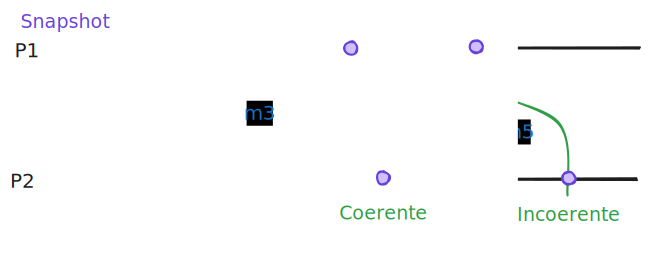
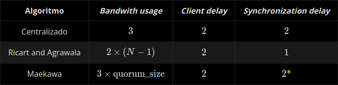
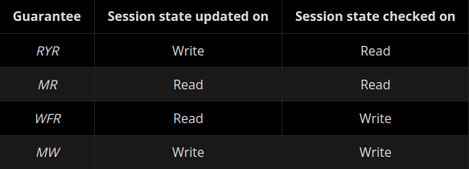

# Introdução a SD
- **Confiabilidade**: proteção contra acesso por indivíduos não autorizados
- **Integridade**: proteção contra alteração ou corrupção
- **Disponibilidade**: proteção contra interferência com os meios de acesso aos recursos

# Modelos Fundamentais
Permitem:
1. Tornar explicitos todos os pressupostos
2. Generalizar o que é possível ou impossível dado 1.

## Modelo de Interção
- Reflete a **forma como a comunicação é feita**

### Características dos Canais de Comunicação

#### Propriedades de desempenho
- **Latência**: tempo entre o começo da transmição e o começo da sua receção
- **Largura de Banda**: quantidade total de informação que pode ser transmitida num canal num dado intervalo de tempo
- **Jitter**: variação no tempo que leva a transmitir uma série de mensages

#### Outras
- **Ordem de mensagens**: se o canal assegura a ordem das mensagens
- **Repetição de mensagens**: se o canal assegura que as mensagens são recebidas apenas uma vez

### Relógios
- **Deriva de relógio**: taxa a que o relógio se afasta do tempo real

### Variantes do Modelo de Interação
- **Sistema Distribuído Síncrono**: *tempo de execução* de cada passo de um processo, *latência* **e** *deriva do relógio* têm todos **limites superiores e inferiores conhecidos**
    - simplifica os problemas a resolver, mas são poucos comuns
- **Sistema Distribuído Assíncrono**: *tempo de execução* do processo, *latência* **ou** *deriva de relógio* são **arbitrários**
    - maior parte dos sistemas são deste tipo

Se um sistema distribuído não é síncrono, então é assíncrono

## Modelo de Faltas
- Reflete a **falibilidade dos componentes do sistema**
- Define e classifica as faltas que podem ocorrer
- Torna possível analisar o (potencial) impacto das faltas e definir como lidar com elas

### Faltas Silenciosas (Omissão) - **benignas**
Ocorrem quando um processo pára e não responde a nenhum estímulo externo
- **fail-stop**: é detetável por outros processos
    - num sistema distribuído **síncrono** são sempre detetáveis através de *timeouts*
- **crash**: caso contrário
    - num sistema distribuído **assíncrono** é muito díficil distinguir se um processo falhou ou se apenas ocorreu um atraso (na execução ou transmissão)

#### Etapas em que pode ocorrer
Processo Emissor -> Buffer de Emissão -Canal de Comunicação-> Buffer de Receção -> Processo Recetor
- **send-omission**: mensagem perdida antes de chegar ao buffer de emissão
- **receive-omission**: mensagem perdida depois de chegar ao buffer de receção, mas antes de chegar ao processo recetor
- **channel-omission**: mensagem perdida no próprio canal de comunicação

### Faltas Arbitrárias (Bizantinas)
**Pior cenário possível** pois qualquer erro pode acontecer
- **Falta arbitrária de processo**: não responde ou responde de forma errada a um estímulo ou responde sem receber qualquer estímulo
    - não é garantido que ocorre de forma consistente, o que torna a deteção muito difícil
- **Falta arbitrária de comunicação**: um canal de comunicação altera os conteúdos de uma mensagem ou a mensagem é repetida ou é entregue uma mensagem que não existe
    - muito mais simples de mascarar do que as de processo

### Mascarar Faltas
Esconder por completo a falta ou torná-la noutra mais aceitável
- **Checksums**: usadas para detetar corrupção de mensagens
- **Números de sequência**: usadas para detetar repetição de mensagens
- **TCP**: mascara faltas silenciosas de comunicação (garante que as mensagens são entregues através de retransmissão)

## Modelo de Segurança
- Reflete a **susceptibilidade do sistema a ataques**
- Define e classifica os ataques que podem ocorrer
- Torna possível encontrar os riscos que corre o sistema e definir como o defender de ataques

# APIs de comunicação
**idempotente** - operação que produz o mesmo estado e devolve a mesma resposta independentemente do número de vezes que for executada
- **gRPC**: HTTP/2 (TLS e TCP)

# Tempo e Sincronização
- **Tick de relógio**: interrupção gerada pelo circuito que conta o número de oscilações do crital de quartzo (ao fim de um determinado número)
- **Coordinated Universal Time (UTC)**: International Atomic Time (TAI) + *leap seconds*

## Métricas
- tempo contado pelo relógio $p$ no instante $t$: $C_p(t)$
- diferença entre dois relógios: $skew(p,q) = C_p(t) - C_q(t)$
- deriva de relógio (taxa a que um relógio se afasta do tempo de referência): $drift\_rate(p) = \frac{dC_p(t)}{dt}$
    - relógio perfeito: $drift\_rate(p) = 1$
    - fabricantes garantem desvio máximo ($\rho$): $1 - \rho \leq drift\_rate(p) \leq 1 + \rho$
        - **correto**: drift rate respeita especificação do fabricante (nem sempre desejável por causa de saltos)
        - **monotonia**: $t' > t \Rightarrow C_p(t') > C_p(t)$
- **precisão** ($\pi$): $\forall_{p,q} : |skew(p,q)| \leq \pi$
- **exatidão** ($\alpha$): $\forall_p : |C_p(t) - t| \leq \alpha$

## Sincronização de Relógios Físicos 
- **sincronização externa**: usada referência externa (máquina instalada com recetor UTC) para obter **precisão** e **exatidão**
- **sincronização interna**: relógios são sincronizados entre si para obter apenas **precisão**

### Algoritmo de Cristian (**Sincronização Externa**)
Sendo $t_{S,m_2}$ o momento em que a resposta sai de $S$
$$ C_p(t) \leftarrow C_S(t_{S,m_2} + \tfrac{RTT}{2}) $$
- **precisão**: $\pm \frac{RTT}{2}$
    - ou se soubermos RTT mínimo: $\frac{RTT - RTT_{min}}{2}$
- Cristian propõe fazer *multicast* do pedido e escolher o primeiro a responder, resultando na melhor **precisão** e evitando um **único ponto de falha**
- Se for preciso um salto para a frente realiza-se diretamente. Se for preciso um retrocesso, para não violar a **monotonia**, a frequência de clock ticks é reduzida até se alcançar o tempo desejado

### Algoritmo de Berkeley (**Sincronização Interna**)
1. Eleito um coordenador ($C$)
2. Periodicamente envia pedidos de tempo a todos os processos
3. Faz a média incluindo a sua
4. calcula a diferença entre o tempo médio e o tempo de cada processo e envia essa diferença ao processo respetivo $$ \Delta t_p = T_{avg} - C_p(t_{p,m_2}) $$

### Network Time Protocol (NTP)
Tanto Berkley como Cristian foram feitos para operar em intranets. NTP define um método para distribuir informação de tempo através da Internet.

Baseia-se no algoritmo de Cristian mas são registados os valores $C_p(t_{p,m_1})$ (saída de m1 de p, segundo p), $C_p(t_{p,m_2})$ (chegada de m2 a p, segundo p), $C_q(t_{q,m_1})$ (chegada de m1 a q, segundo q) e $C_q(t_{q, m_2})$ (saída de m2 de q, segundo q).

São calculados os valores: $$ \delta_{m1} = C_q(t_{q,m_1}) - C_p(t_{p,m_1}) $$ $$ \delta_{m2} = C_p(t_{p,m_2}) - C_q(t_{q,m_2}) $$

O **offset** $\theta$ (uma estimativa do $skew(p,q)$ com incerteza $\frac{\delta}{2}$) e o **delay** $\delta$: $$ \theta = \frac{\delta_{m_1} - \delta_{m_2}}{2} $$ $$ \delta = \frac{\delta_{m_1} + \delta_{m_2}}{2} $$

O NTP pode funcionar em:
- **Multicast**: algoritmo anterior não se aplica
- **Chamada a procedimento**: decorre de acordo com o algoritmo
- **Simétrico**: sincronização em ambos os sentidos (ambos os servidores atualização o tempo)
    - Para isto divide-se servidores em níveis (*strata*), pois há servidores mais exatos que outros
        - Nível 1: servidor com relógio de referência (recetor UTC)
        - Nível 2: sincroniza com nível 1
        - Nível 3: sincroniza com nível 2
        - ...

## Eventos e Relógios Lógicos
- **evento**: qualquer operação que transforma o estado do processo, ou $recv(m)$ ou $send(m)$ (recebimento e envio de mensagens)
- $e$ antecede $e'$ segundo o processo $p_i$: $e \rightarrow_i e'$

### Definição de *happens-before*
1. Se $\exists p_i : e \rightarrow_i e'$, então $e \rightarrow e'$
2. Se $\exists m : e = send(m) \wedge e' = recv(m)$, então $e \rightarrow e'$
3. Se $e \rightarrow e' \wedge e' \rightarrow e''$, então $e \rightarrow e''$

$e$ e $e'$ são concorrentes ($e \space || \space e'$) sse $e \nrightarrow e' \wedge e' \nrightarrow e$

### Relógio Lógico de Lamport
Cada processo $p_i$ mantém um relógio lógico **monótono** $L_i$ que pode ser usado para atribuir uma estampilha temporal a um evento $e$ ($L_i(e)$). É usado $L(e)$ quando não interessa o número do processo.

1. $L_i$ é incrementado sempre que um evento é observado por $p_i$
2. Quando $p_i$ envia uma mensagem, inclui a estampilha $t$ com o valor de $L_i$ após executar 1.
3. Quando $p_i$ recebe uma mensagem, $L_i = max(L_i, t)$ e depois executa 1.

Isto garante a propriedade (**MAS NÃO O INVERSO** - para superar esta limitação usamos Vector Clocks): $$ e \rightarrow e' \Rightarrow L(e) < L(e') $$

### Vector Clocks
Cada processo $p_i$ mantém um vector clock $V_i$ que pode ser usado para atribuir uma estampilha temporal a um evento $e$ ($V_i(e)$). É usado $V(e)$ quando não interessa o número do processo.

1. Inicialmente $V_i[j] = 0$ para todo o $j$
2. $V_i[i]$ é incrementado sempre que um evento é observado por $p_i$
3. Quando $p_i$ envia uma mensagem, inclui a estampilha $t$ com o valor de $V_i$ após executar 2.
4. Quando $p_i$ recebe uma mensagem, atualiza cada campo do vector clock $V_i[j] = max(V_i[j],t[j])$ para todo o $j$ e depois executa 2.

Isto garante a propriedade: $$ e \rightarrow e' \Leftrightarrow L(e) < L(e') $$

Usando comparação da seguinte forma:
1. $V = V' \Leftrightarrow V[j] = V'[j]$ para todo o $j$ 
2. $V \leq V' \Leftrightarrow V[j] \leq V'[j]$ para todo o $j$
3. $V < V' \Leftrightarrow V \leq V' \wedge V \neq V'$

## Salvaguarda distribuída

### Abordagem ingénua
1. Coordenador central pede para todos os processos pararem o que estão a fazer
2. Pede para criarem uma snapshot do seu estado atual
3. Envia uma notificação para os processos continuarem quando receber as snapshots de todos

### Corte coerente
Um corte é coerente se, para cada evento que contém, também inclui os eventos que *happened-before* desse evento

Se existirem "efeitos" sem "causa" o corte é incoerente.

#### Algoritmo Simples
- qualquer processo pode iniciar uma salvaguarda global, guardado o seu estado local
- quando um processo $p_i$ acaba de guardar o seu estado envia um **marker** para todos os outros processos e continua a sua execução normal
- quando um processo $p_i$ recebe um **marker**, se ainda não guardou o seu estado local, guarda-o

Este algoritmo **NÃO GARANTE A COERÊNCIA DO CORTE**

#### Algoritmo de Chandy-Lamport
Extende o anterior de forma a capturar o estado dos canais.

Pressupostos: (**TODO: DECORAR**)
- não há falhas nos processos nem nos canais (ou seja, que são fiáveis)
- os canais são unidirecionais com uma implementação FIFO
- o grafo de processos e canais é fortemente ligado (isto é, existe um caminho entre quaisquer dois processos)
- qualquer processo pode iniciar uma snapshot global a qualquer momento
- os processos podem continuar a sua execução normal (e enviar/receber mensagens) enquanto a snapshot está a decorrer

A única diferença para o último algoritmo é (???): Cada processo guarda o seu estado local e, para cada canal de receção, guarda também o conjunto de mensagens recebidas após o snapshot. Desta forma, o processo regista quaisquer mensagens que tenham chegado depois de ter guardado o seu estado e antes do remetente ter registado o seu estado.

# Coordenação e Consenso

## Exclusão mútua distribuída

### Requisitos essenciais
1. Safety: apenas um processo pode estar na secção crítica
2. Liveness: pedidos para entrar e sair da secção crítica eventualmente são bem sucedidos
3. Happened-before ordering: se um pedido para entrar na secção crítica ocorreu antes de outro, a entrada é concedida nessa ordem

### Algoritmo do servidor central
1. processo envia pedido ao servidor e aguarda resposta
2. se nenhum, processo tiver a chave, o servidor responde imediatamente, concedendo a chave
3. se a chave estiver detida por outro processo, o servidor não responde e coloca o pedido numa fila de espera

#### Desvantagens
- sobrecarga do servidor
- se o servidor falhar o sistema bloqueia
- é necessário devolver a chave ao servidor (entregar diretamente ao próximo cliente seria mais eficiente)

### Algoritmo baseado em anel
Cada processo $p_i$ tem um canal de comunicação com o próximo processo no anel, $p_{(i+1) mod N}$

- a chave é sempre reencaminhada para o próximo vizinho.
- se não precisa, reenchaminha imediatamente
- se precisa fica com ela o tempo que necessitar, depois reencaminha

### Algoritmo de Ricart and Agrawala
3 estados:
- `HELD`: tem acesso exclusivo à região crítica
- `WANTED`: não tem acesso mas quer obter
- `RELEASED`: não precisa de acesso à região crítica

1. envia pedidos a todos os processos
2. qnd um processo recebe um pedido, (se tiver acesso) ou (também quiser o pedido e já o quiser há mais tempo), coloca o que recebeu na lista de espera. caso contrário, responde imediatamente
3. quando um processo sai da secção crítica, responde a todos os pedidos em espera

#### Desvantagens
- não é tolerante a faltas
- em vez de sobrecarregar o servido, sobrecarrega os processos

### Algoritmo de Maekawa
- quóruns
- cada processo só pode votar num pedido
- **Propriedade Fundamental**: Em qualquer par de quóruns, há sermpre interseção em pelo menos um processo, o que implica que dois pedidos concorrentes nunca podem ambos receber os votos de quóruns completos

**quóruns** (ou voting sets):
- $p_i \epsilon V_i$
- $V_i \cap V_j \neq \varnothing$ (há pelo menos um membro comum entre quaisquer dois quoruns)
- $|V_i| = K$ (todos os quoruns têm o mesmo tamanho)
- cada processo $p_i$ está contido em $M$ quóruns

Solução ótima:
- $K ~ \sqrt{N}$
- $M = K$
- **TODO: VER NOTA DE COMO DETERMINAR ISTO DE MANEIRA FÁCIL ATRAVÉS DE MATRIZ**

É **DEADLOCK-PRONE**:
- 3 processos e $V_1 = \{p_1, p_2\}, V_2 = \{p_2, p_3\}, V_3 = \{p_3, p_1\}$
- $p_1$ responde a si mesmo e mete $p_2$ em espera
- $p_2$ responde a si mesmo e mete $p_3$ em espera
- $p_3$ responde a si mesmo e mete $p_1$ em espera

### Comparação dos algoritmos

- Bandwith usage: total de msgs entre enter/exit por um mesmo cliente
- Client delay: tempo para um processo entrar numa secção crítica livre
- Synchornization delay: tempo entre exit por um processo e enter por outro que estava à espera
- \* assumindo que os 2 quóruns se intercetam em apenas 1 processo

#### Distribuição de carga
- Centralizado: tudo passa pelo servidor
- Ricart and Agrawala: todos os processos são sobrecarregados
- Maekawa: cada pedido afeta um subconjunto de processos (quórum)

#### Tolerância a falhas
- **Todos assumem rede fiável. Nenhum tolera perdas de mensagens**
- Centralizado: não tolera falha do servidor, mas tolera falha de cliente em estado `RELEASE`
- Ricart and Agrawala: nenhum processo pode falhar
- Maekawa: cada pedido tolera falhas dos processos que não estejam no quórum

## Eleição de líder
Assegurar 2 propriedades:
- E1 (safety): todos os processos escolhem o mesmo líder (tipicamente o processo com id maior)
- E2 (liveness): a execução do algoritmo é finita

Assume-se que:
- **O detetor de falhas é perfeito**, ou seja, nunca diagnostica erradamente um processo como morto
- **Os processos não recuperam**, ou seja, não voltam ao ativo depois de morrerem

### Eleição em anel
Cada processo $p_i$ tem um canal de comunicação com o próximo processo no anel, $p_{(i+1) mod N}$. As mensagens são enviadas no sentido horário ao redor do anel

Quando `p` decide iniciar uma eleição:
- marca-se como participante
- envia `election(id(p))` para o próximo

Quando `p` recebe uma mensagem `election(id)`:
- **Se o id na mensagem é superior** ao indentificador local: reencaminha-a ao próximo e marca-se como participante
- **Se o id na mensagem é inferior** e `p` ainda não participava: substitui o id na mensagem pelo de `p`, reencaminha-a ao próximo e marca-se como participante
- **Se o id na mensagem é o de `p`**, `p` torna-se o novo líder. Marca-se como não participante e envia mensagem `elected(id(p))` ao próximo

Quando `p` recebe uma mensagem `elected(id)`
- Aprende que o novo líder é aquele indicado na mensagem, reencaminha a mensagem e marca-se como não participante
- Se o id na mensagem for o de `p`, não faz nada (algoritmo terminado)

Pode gerar até $3N - 1$ mensagens. Se todos os processos decidirem começar o processo de eleição ao mesmo tempo, o algoritmo tem uma **complexidade temporal quadrática**.

### Eleição em anel por torneio
- os processos procuram um líder num horizonte que duplica em cada turno
- em cada turno o número de competidores vai sendo reduzido para metade
- isto resulta na execução de $log(n)$ turnos para um complexidade total de $nlog(n)$

### Algoritmo "Bully"
Pressupostos:
- tempos máximos para a comunicação (sistema síncrono; canais fiáveis)
- processos podem falhar
- processos conhecem os identificadores dos restantes

Tipos de mensagem:
`election`: assinala o início de uma eleição
`answer`: serve de resposta a uma mensagem `election`
`coordinator`: assinala o id do processo elegido (o novo coordenador)

Os processos iniciam uma eleição quando detetam que o coordenador falhou (timeout):
- se for o processo com id mais alto: elege-se a si mesmo e envia uma mensagem `coordinator` para todos os processos com id mais baixo
- se não: envia a todos os processos com ids mais altos que ele uma mensagem `election`:
    - se não receber nenhuma `answer`, considera-se coordenador e envia uma mensagem `coordinator` a todos os processos com id mais baixo
    - se receber, espera durante um período de tempo por uma mensagem `coordinator` e caso não receba, começa um nova eleição
    
Quando um processo recebe uma mensagem `coordinator`:
- regista o id recebido na mensagem e passa a tratar esse processo como coordenador

Quando um processo recebe uma mensagem `election`:
- envia de volta uma mensagem `answer`
- começa uma nova eleição (a não ser que já tenha começado uma)

Quando um novo processo vem substituir um outro crashed:
- começa uma nova eleição: se tiver o id mais alto: decide que é o líder e anuncia-o (mesmo que o atual líder esteja a funcionar, daí ser chamado bully)

Observações:
- no melhor caso (o segundo maior identifica percebe a falha do coordenador e elege-se imediatamente), são enviadas $N - 2$ mensagens `coordinator`
- no pior caso (o identificador mais baixo percebe a falha do coordenador), $N - 1$ processos iniciam eleições simulatneamente, cada um enviando mensagens para os processos com identificadores mais altos, o que é $O(N^2)$
- o algoritmo não garante a condição E1, no caso em que os processos que falham são substituidos, visto que ambos se anunciam como coordenadores simultaneamente

### Algoritmo do "Luís"
Consiste em ter um detetor de falhas que notifica todos os processos sempre que algum falha:
- Inicialização:
    - $ativos = p_0, p_1, p_2, ..., p_n$
    - $líder = max_{id}(ativos)$
    - $output(líder)$
- Quando um processo ($p_i$) falha:
    - $ativos = ativos \\ \{p_i\}$
    - $líder = max_{id}(ativos)$
    - $output(líder)$
    
### Comparação dos algoritmos Bully vs "Luís"
Algoritmo do "Luís":
- simples
- modular
- menos eficiente pois obriga a detetar falhas em processos que não são candidatos a líder

Algoritmo Bully:
- mistura deteção de falhas com eleição de líder
- cada processo apenas precisa de detetar falhas de outros com id maior

### Deteção de falhas "alguma-vez" ("eventually") perfeita
O detetor pode temporariamente errar, mas há um momento a partir do qual volta a estar correto

## Problema do Consenso

### Definição
Dado um conjunto de $N$ processos:
1. Cada processo propõe um valor (input)
2. Todos os processos decidem o mesmo valor (output)

### Propriedades
- **Terminação**: todos os processos correctos decidem ("alguma-vez")
- **Acordo uniforme**: se dois processos decidem, decidem o mesmo valor
- **Integridade**: o valor decidido (output) foi proposto por um processo

### Floodset Consensus (sistemas síncronos)
- em cada ronda, cada processo faz broadcast do seu valor
- ao receber um valor de outro processo, adiciona-o ao seu conjunto
- ao fim de $f+1$ rondas, é escolhido o output com base num critério determinístico utilizado por todos os processos
    - em que $f$ é o número de processos que pode falhar
    
Qualquer algoritmo desenhado para resolver o consenso permitindo até $f$ falhas, requer pelo menos $f+1$ rondas de trocas de mensagens, independentemente da forma como foi construído

### Problemas relacionados
#### Coerência Interativa
- conjunto de N processos
- cada processo $p_i$ propõe um valor ($input_i$)
- todos os processos decidem o mesmo vetor V (output)
- o vetor V decidido tem uma entrada por cada processo que:
    - ou V[i] = $input_i$
    - ou V[i] = null
    
Propriedades:
1. Terminação: todos os processos correctos decidem ("alguma-vez")
2. Acordo uniforme: se dois processos decidem, decidem o mesmo vetor V
3. Integridade: se o processo $p_i$ não falhar, V[i] = $input_i$

#### Derivar Consenso a partir de Coerência Interativa
$ C_i(v_1, ..., v_N) = majority(IC_i(v_1, ..., v_N)[1], ..., IC_i(v_1, ..., v_N)[N]) $

#### Difusão com terminação
- conjunto de N processos
- um processo pré-definido s envia uma mensagem m
- se o processo s falha, os processos entregam m ou null
- todos os processos corretos entregam o mesmo valor (ou m ou null)

Propriedades:
1. Terminação: todos os processos correctos decidem ("alguma-vez")
2. Acordo uniforme: se dois processos decidem, decidem o mesmo valor v
3. Integridade: se o processo s não falhar, v = m

# Replicação e Tolerância a Faltas
Benefícios:
- melhor disponibilidade (sistema continua disponível mm que alguns nos falhem ou fiquem indisponiveis com falhas na rede)
- melhor desempenho e escalabilidade
    - podem existir cópias mais próximas do cliente
    - algumas operaçãoes não precisam de ser executadas sobre todo o sistema, podendo ser apenas sobre algumas cópias (distribuindo a carga e aumentando a escalabilidade)

## Linearizabilidade

As operações realizadas sobre um sistema replicado não são instantâneas: a operação é invocada por um cliente, executa durante algum tempo, e o cliente recebe a resposta mais tarde.

Se X começa depois de Y acabar, então X ocorre depois de Y

Se X começa antes de Y acabar, então X é concorrente com Y

1. Existe uma **serialização virtual** que respeita o **tempo real** em que as operações foram invocadas, isto é:
    - Se $op_1$ ocorre antes de $op_2$ (em tempo real), então $op_1$ tem de aparecer antes de $op_2$ na serialização virtual. (se forem concorrentes a serialização pode ordená-las de forma arbitrária)
2. A execuação observada por cada cliente é coerente com essa serialização (para todos os clientes), ou seja:
    - Os valores retornados pelas leituras feitas por cada cliente refletem as operações anterioores na serialização

## Registos partilhados e replicados
Registo suportam duas operações:
- Escrita
    - subistitui o valor da anterior
    - apenas um cliente pode escrever num dado instante (são ordenadas)
- Leitura
    - múltiplos clientes podem ler do registo ao mesmo tempo
    
Tipos:
- Safe
    - Se uma leitura não for concorrente com uma escrita, lê o último valor escrito
    - Se for, pode retornar um valor arbitrário
- Regular
    - Se uma leitura não for concorrente com uma escrita, lê o último valor escrito
    - Se for, ou retorna o valor anterior ou o valor que está a ser escrito
    - Não linearizável: é possível que leituras seguidas leiam sequências incoerentes de valores (primeiro o novo valor, depois o antigo)
- Atomic
    - Equivalente a linearizabilidade quando aplicada a registos
    - O resultado da execução é equivalente ao resultado de uma execução em que todas as escritas e leituras ocorrem instantaneamente num ponto entre o início e o fim da operação
    
### Registos distribuídos
É possível implementar de forma tolerante a faltas e não bloqueante este algoritmo:
- cada processo mantém uma cópia do registo
- cada registo guarda um tuplo `<valor, versão>`
- para executar uma operação (leitura ou escrita), os processos trocam mensagens entre si

#### Algoritmo ABD
#### Registo regular (com um só escritor)
- Escrita:
    - o escritor incrementa o número de versão e envia o tuplo `<valor, versão>` para todos os processos
    - quando os outros processos recebem esta mensagem, atualizam a sua cópia do registo (caso seja uma versão mais recente que a local) e enviam uma confirmação ao escritor
    - a operação termina quando o escritor receber resposta de uma maioria
- Leitura:
    - o leitor envia uma mensagem a todos os processos solicitando o tuplo mais recente
    - cada processo envia o seu tuplo `<valor, versão>`
    - após receber resposta de uma maioria, retorna o valor mais recente e atualiza o valor local (caso necessário)
    
O algoritmo não é atómico: é possível obter leituras diferentes consoante as réplicas que contactamos, violando o príncipio da linearizabilidade. 

#### Registo atómico (com um só escritor)
- Escrita:
    - igual ao anterior
- Leitura
    - executa o algoritmo anterior de leitura, mas não retorna valor
    - executa o algoritmo de escrita, usando o valor lido
    - retorna o valor lido apenas após a escrita ter terminado

### Espaço de Tuplos
#### Espaço de tuplos "Linda"
Espaço partilhado que contém tuplos e permite operações:
- `PUT`
- `READ`, bloqueante, aceita wildcards
- `TAKE`, bloqueante, aceita wildcards

Como `TAKE` é bloqueante pode ser usado para sincronizar processos

#### Xu-Liskov
Implementação distribuída e tolerante a faltas do "Linda"

**TODO relembrar o algoritmo**

## Teorema CAP
É impossível um sistema apresentar simultaneamente:
- Consistency (coerência)
- Availability (disponibilidade)
- Partition-tolerance (tolerância a partições na rede)

Apenas pode ter 2 destas propriedades.

## Coerência fraca
### Garantias de sessão
- Read Your Writes
    - Se um Read R procede um Write W numa sessão, então o valor de W é incluído em R
- Monotonic Reads
    - Se um Read R1 precede um Read R2 numa sessão, R2 tem que incluir todos os Writes completos incluídos em R1
- Writes Follow Reads:
    - Se um Read R1 precede um Write W2 numa sessão e R1 é executado no servidor S1, então qualquer servidor S2 que inclui W2 também inclui qualquer Write W1 incluido em R1 na ordem em que foram escritos
- Monotonic Writes:
    - Se um Write W1 precede um Write W2 numa sessão, então qualquer servidor S2 que inclua W2 também inclui W1 na ordem que foram escritos
    

**TODO QUÊ???**

### Propagação epidémica (gossip propagation)
- Periodicamente, cada processo contacta os outros e envia-lhes informação/atualizações
- Vantagem de ser totalmente descentralizada, balanceia as cargas por todos os processos

Grande parte dos sistemas de propagação epidémica aplica as atualizações de forma a respeitar a relação aconteceu-antes (respeita a ordem causal dos acontecimentos)

#### Clientes móveis
- Um cliente muda a sua password na réplica R1
- Muda para a réplica R2 antes da alteração ser propagada
- Não consegue utilizar a sua nova password

Existem sistemas capazes de garantir a relação aconteceu-antespara clientes móveis, enquanto que outros oferecem garantias ainda mais fracas como as Garantias de sessão apresentadas acima.

Todas estas garantias podem ser atingidas com o uso de relógios lógicos (pouco eficiente)

### Lazy Replication - gossip architecture
- garante acesso rápido aos clientes
- mesmo quando existem partições na rede
- trade-off de sacrificar coerência

Oferce coerência fraca, mas assegura:
- Monotonic reads
- estado das réplicas respeitam a ordem causal das alterações

#### Interação cliente-réplica
- cada cliente mantém um timestamp vetorial denominado prev (um inteiro por réplica, reflete a última versão acedida pelo cliente)
- em cada contacto com uma réplica, é enviado o prev: `(pedido, prev)`
- a réplica devolve `(resposta, new)`
    - new -> timestamp vetorial  que reflete o estado da réplica
    - caso esteja atrasada, espera até se atualizar e só depois responde (para leitura)
- cliente atualiza prev de acordo com new: se new[i] > prev[i], prev[i] = new[i]
- cada réplica mantém um update log
    - estado pendente no log: recebeu modificação mas ainda nao executou dependências causais
    - propagar modificações individuais para as outras réplicas, mantendo o update no log até receber confimação de todas

#### algoritmo

- quando uma réplica recebe um pedido de leitura:
    - verifica se pedido.prev <= valueTS
        - se sim, retorna o valor atual juntamente com o valueTS
        - se nao, o pedido fica pendente até estar atualizada
- quando uma réplica i recebe um pedido de modificação:
    - verifica se já o executou e em caso afirmativo descarta-o
    - incrementa a entrada i do seu replica timestamp em uma unidade
    - atribui à modificação um novo timestamp calculado por: pedido.prev com a entrada i substituída pelo valor calculado acima (gerando assim um timestamp único para este update)
    - adiciona a modificação ao log e retorna o novo timestamp ao cliente
    - espera até pedido.prev <= valueTS se verificar para executar o código localmente  
    - quando o pedido é executado atualiza o valueTS: se replicaTS[j] > valueTS[j], valueTS[j] = replicaTS[j]
- para propagar modificações (gossip):
    - periodicamente (ou então quando precisa de uma certa atualização para processar um pedido) cada gestor de réplica i contacta outro gestor j
    - i envia de forma ordenada a j as modificações do seu log que estima que j não tem
    - para cada modificação que j recebe:
        - se não for duplicada, adiciona ao seu log
        - atualiza o seu replicaTS
        - assim que prev <= valueTS, executa a modificação
    
### Algoritmo de Bayou
Lazy Replication assume que as operações concorrentes são comutativas

Bayou introduz uma solução para reconciliar automaticamente réplicas divergentes:
- Ordenar operações concorrentes por ordem total
- Cancelar operações que foram executadas por ordem diferente
- Re-aplicar estas operações pela ordem total, aplicando uma função de reconciliação
- Operações podem ser codificadas de forma a facilitar a reconciliação automática

Updates: tentativo e commit:
- Quando se faz um update ele fica marcado como tentativo: pode ainda sofrer alteraçoes
- quando update é commited a sua ordem ja nao pode ser alterada
    - quem decide a ordem é tipicamente uma replica especial, o primário
    - quando um update é commited as outras réplicas podem por isso ter que o ordenar 

### CRDTs (Conflict-Free Replicated Datatypes)
CRDT é uma estrutura de dados replicada em vários computadores numa rede, com características:
- aplicação pode atualizar qualquer répica de forma independente, concorrente e sem precisar de comunicar com outras réplicas
- um algoritmo (que faz parte da propria estrutura de dados) resolve automaticamente quaisquer inconsistências que possam surgir entre réplicas
- embora as réplicas possam ter estados diferentes num determinado momento, é garantido que eventualmente irão convergir

## Coerência forte
### Tolerância a faltas
- Recuperação "para trás":
    - guardar o estado do sistema de forma periódica ou em momentos relevantes (salvaguarda distribuída)
    - quando os processos falham, são relançados o mais rapidamente possível
    - os novos processos recomeçam a partir do último estado guardado
    - estados guardados dos processos que falharam devem estar mutuamente coerentes
- Recuperação "para a frente":
    - são mantidas várias cópias (réplicas) do processo
    - quando é feita uma alteração a uma réplica, esta deve ser propagada para todas as outras de forma a estarem atualizadas/sincronizadas
    - se uma réplica falha, o cliente pode passar a utilizar outra
    - estrutura de dados replicada:
        - registo (algoritmo ABD)
        - espaço de tuplos (xu-liskov)
        - qualquer estrutura de dados que ofereça uma interface remota (exige algoritmos de replicação genéricos, tema deste capítulo)
        - réplicas que sobrevivem devem estar mutuamente coerentes
    
Iremos ver dois algoritmos de replicação genéricos (por recuperação para a frente):
- Primário-secundário
- Replicação de máquina de estados

### Algoritmo Primário-secundário (esboço)
- É eleito um processo como primário (sendo outro eleito em caso de falha)
- pedidos dos clientes são enviados para o primário
- quando o primário recebe um pedido
    - executa-o
    - propaga o estado para os secundários e aguarda confirmação de todos
    - responde ao cliente
    - (processa o próximo pedido que estiver na fila)

Vantagens:
- suporta operações não determinísticas (primário decide o resultado)

Desvantagens:
- se o primário produzir um valor errado, o erro é propaga para as réplicas
- se o detetor de falhas não for perfeito, pode existir mais que um primário concorrentemente, havendo o risco dos estados divergirem

### Replicação de máquina de estados (esboço)
- os clientes enviam os pedidos para todas as réplicas
- os pedidos são ordenados por ordem total
- todas as réplicas processam os mesmos pedidos, pela mesma ordem
    - assume-se que as operações são determinísticas, de forma a todas as réplicas ficarem idênticas
- cada réplica responde ao cliente (o número de respostas pelo qual o cliente aguarda depende das suposições de falhas)

Vantangens:
- se uma réplica produz um valor errado, não afecta as outras

Desvantagens:
- as operações necessitam de ser determinísticas
- se o detetor de falhas não for perfeito, pode ser impossível estabelecer uma ordem total dos pedidos

### Abstrações para a construção de sistemas replicados
#### Canais perfeitos
- garante a entrega de mensagens ponto a ponto de forma ordenada, caso nem o emissor nem o destinatário falhem
- na prática: retransmitir a mensagem até que a receção desta seja confirmada pelo destinatário

#### Difusão Fiável
- permite difundir uma mensagem com a garantia de que ou todos os destinatários a recebem ou nenhum recebe

##### Regular
- Validade: se um processo p correto envia uma mensagem, então eventualmente p entrega m
- Não-duplicação: nenhuma mensagem é entregue mais que uma vez
- Não-criação: se uma mensagem é entregue então foi enviada por um processo correto
- Acordo: se um processo correto entrega m, então todoso os processos corretos entregam m

Algoritmo:
- o emissor envia a mensagem usando canais perfeitos para todos os membros do grupo
- quando um membro do grupo recebe a mensagem, entrega-a à aplicação e reenvia-a para todos os membros do grupo

##### Uniforme
Igual a Regular mas:
- Acordo: se um processo (correto ou não) entrega m, então todos os processos corretos entregam m

Algoritmo:
- o emissor envia a mensagem usando canais perfeitos para todos os membros do grupo
- quando um membro do grupo recebe a mensagem, reenvia-a para todos os membros do grupo
- quando um membro receber uma mensagem m de f membros distintos, entrega a mensagem m à aplicação
- f é o número de processos que pode falhar. $f < \frac{N}{2}$

#### Sincronia na Vista
Vista: conjunto de processos que pertence ao grupo
- novos membros podem ser adicionados dinamicamente
- um processo pode sair voluntariamente do grupo ou ser expulso caso falhe

Propriedades:
- permite alterar a filiação de um grupo de processos de uma forma que facilita a tolerância a faltas
- a evolução do sistema é dada por uma sequência totalmente ordenada de vistas
- um processo é considerado correto numa vista $V_i$ se faz parte dessa vista e de $V_{i+1}$
    - se não pertence, pode ter falhado durante $V_i$
- uma aplicação que a que já foi entregue $V_i$ mas não $V_{i+1}$ diz-se que está na vista $V_i$
- uma aplicação que usa o modelo Sincroniza na Vista recebe vistas e mensagens
- uma mensagem enviada na vista $V_i$ é entregue na vista $V_i$
- Se um processo q se junta a um grupo e se torna indefinidamente alcançável a partir do processo p (sendo $p \neq q$), então eventualmente q estará sempre nas views que p entrega (a mesma lógica pode ser aplicada a processos que não conseguem comunicar)

Isto culmina em duas principais propriedades:
- Comunicação fiável
    - se um processo correto p na vista $V_i$ envia uma mensagem m na vista $V_i$, então m é entregue a p na vista $V_i$
    - se um processo entrega uma mensagem m na vista $V_i todos os processos corretos da vista $V_i$ entregam m na vista $V_i$
- Colorário: dois processos que entregam as vistas $V_i$ e $V_{i+1}$ entregam exactamente o mesmo conjunto de mensagens na vista $V_i$

Para mudar de vista:
- é necessário interromper temporariamente a transmissão de mensagens de forma a que o conjunto de mensagens a entregar seja finito
- é necessário executar um algoritmo de coordenação para garantir que todos os processos corretos chegam a acordo sobre
    - qual a composição da próxima vista
    - qual o conjunto de mensagens a ser entregue antes de mudar de vista

#### Difusão Atómica
Consiste em ter as garantias de Difusão Fiável + Ordem Total
- Difusão Fiável: se uma réplica recebe o pedido, todas as réplicas recebem o pedido
- Ordem Total: todas as réplicas recebem os pedidos pela mesma ordem

A abordagem básica é atribuir identificadores totalmente ordenados às mensagens multicast, de modo a que cada processo tome a mesma decisão de ordenação com base nesses identificadores

##### Algortimos de ordem total (sem falhas)
- Ordem total baseada em sequenciador:
    - as mensagens são enviadas para todas as réplicas usando um algoritmo de Difusão Fiável
    - é eleito um líder que decide a ordem pela qual as mensagens devem ser processadas, enviando esta informação para as réplicas restantes
    - quando existe uma falha, as réplicas podem ser confrontadas com um estado incoerente
        - mensagens de dados que não foram ordenadas pelo líder
        - mensagens do líder referentes a mensagens que ainda não chegaram
        - podem existir de forma geral diferenças nas perspectivas que cada réplica tem do sistema
        - **todos estes problemas são resolvidos na camada de Sincronia na Vista**
- Ordem total baseada em acordo coletivo:
    - um processo envia uma mensagem multicast para os membros do grupo
    - estes processos propõem números de sequência para a mensagem (atribuição "tentativa") e devolvem-nos ao remetente, que gera o número de sequência acordado com base nos números propostos (atribuição final)
    - o algoritmo funciona mesmo que cada mensagem seja enviada para um sub-conjunto diferente de nós
    - quando há falhas, é preciso executar um algoritmo de reconfiguração que fica bastante simplificado pela Sincronia na Vista
    - algoritmo Skeen: cliente escolhe o maior dos números de sequência propostos
    
### Algoritmo Primário-secundário (concretizado)
- Primário usa Difusão Fiável Uniforme síncrona na vista para propagar novos estados aos secundários
    - só responde ao cliente quando a uniformidade estiver garantida
- Réplicas usam Sincronia na Vista para lidar com falhas do primário
    - quando o primário p falha, eventualmente será entregue nova vista sem p
    - quando uma nova vista é entregue e o anterior primário não consta nela, os restantes processos elegem o novo priário
    - o novo primário anuncia o seu endereço num serviço de nomes (para que os clientes o descubram)
- Alcança linearizabilidade

### Replicação de máquina de estados (concretizado)
- Processos usam Sincronia na Vista
- Clientes usam Difusão Atómica síncrona na vista para enviar pedidos a todas as réplicas
- Não alcança linearizabilidade pois a ordem total na qual os gestores de réplicas processam os pedidos pode não coincidir com a ordem real na qual os clientes fizeram os pedidos

## Consenso e Replicação

### Difusão atómica usando Consenso
- cada processo guarda uma lista de mensagens recebidas e ordenadas
- sempre que tiver alguma mensagem recebida que ainda não está ordenada, propõe essa mensagem para consenso (uma instância de consenso por mensagem a ordenar)
- o consenso decide qual a próxima mensagem, que é adicionada à lista de mensagens ordenadas de cada processo

Como o consenso pode decidir qualquer uma das mensagens propostas, é possível que uma mensagem que apenas um processo recebeu nunca seja decidida. A solução é propôr para consenso todas as mensagens recebidas mas não ordenadas. A decisão do consenso será qualquer um dos sets propostos pelos processos.

### Primário-secundário com detector de falhas não perfeito
Já abordámos uma implementação de replicação com Primário-secundário que utilizava Sincronia na Vista e Difusão Fiável, mas será que é possível construir uma solução robusta sem um detector de falhas perfeito?

Podemos usar o algoritmo Paxos
- o Paxos garante que o sistema apenas avança quando tem aprovação da maioria das réplicas

### Sincronia na Vista usando Consenso
Mudar da vista $V_i$ para a vista $V_{i+1}$ consiste essencialmente em
- recolher todas as mensagens entregues durante $V_i$
- propôr para consenso um tuplo: $V_i$ = \<membros de $V_{i+1}$, mensagens entregues em V_i\>
- esperar decisão do consenso
- entregar mensagens em falta
- entregar nova vista

Funcionamento do algoritmo:
- cada processo mantém um registo $h_i$ de todas as mensagens que já entregou numa dada vista
- quando se inicia a munda de vista $V_i$ para $V_{i+1}$, é enviada uma mensagem especial "view-change(saídas, entradas)" para todos os processos da vista $V_i$ (podendo a lista de saídas e/ou entradas ser vazia)
- quando um processo recebe uma mensagem "view-change(saídas, entradas)", pára de entregar novas mensagens e inicia $V_{i+1}$ = $V_i$ - saídas + entradas, $h_j$ = null para todos os processos $p_j$ na vista $V_i$ e envia $h_i$ para todos os processos em $V_{i+1}$
- cada processo recebe os valores $h_j$ de todos os outros processos $p_j$ em $V_i$
- se um processo $p_i$ não recebe $h_j$ de um processo $p_j$ e suspeita que $p_j$ falhou, remove $p_j$ de $V_{i+1}$ e coloca $h_j$ = { }
- quando um processo $p_i$ tem todos os valores de $h_j \neq$ null (ou seja, se já recebeu $h_j$ de $p_j$ ou se assume que $p_j$ falhou), define o conjunto de mensagens a entregar $m - V_i$ como a união de todos os $h_j$ recebidos e inicia o consenso propondo \<$V_{i+1}$, $m - V_i$\>
- o resultado do consenso define a nova vista e o conjunto de mensagens a entregar na vista anterior

# Transações Distribuídas

## Transação
Consiste numa sequência de instruções que é executada de forma aparentemente atómica, ou seja, ou todas são executas o nenhuma é (indivisível)

Normalmente é delimitada por instruções específicas, como por exemplo:
- begin-transaction
- end-transaction, commit, abort

### Propriedades ACID
- Atomicidade (Atomicity)
    - ou a transação é executada na totalidade, ou não produz qualquer efeito
    - quando é executada com efeito diz-se confirmada
    - se não produz qualquer efeito, diz-se que abortou
        - pode abortar a pedido, ou por problemas que aconteceram durante a execução
- Coerência (Consistency)
    - a execução de uma transação não resulta na violação das invariantes que caracterizam o modelo de dados
- Isolamento (Isolation)
    - define como o sistema se comporta quando são executadas transações de forma concorrente que acedem aos mesmos objetos
    - alguns exemplos de isolamento (não iremos estudar):
        - serializabilidade estrita
        - serializabilidade
        - isolamento instantâneo ("snapshot isolation")
        - coerência transacional causal
    - **serializabilidade de transações**: o resultado da execução concorrente de um conjunto de transações deve ser equivalente ao resulto de as executar em série, uma de cada vez
- Durabilidade (Durability)
    - os resultados da transação ficam registados de forma persistente na base de dados

#### Atomicidade: utilização do "redo log"
- os resultados da transação não são aplicados durante a execução, apenas quando a transação é commited
- antes de aplicar os resultados, estes são escritos para um log persistente, juntamente com a informação de que a transação foi confirmada
- começa-se a aplicar os resultados apenas depois da persistência do log ser garantida
- se ocorrer um erro/falha que interrompa a aplicação dos resultados, quando a máquina recuperar consulta o log para continuar a partir do ponto de interrupção

#### Isolamento: strict 2-phase locking (controlo pessimista)
- método pessimista de controlo de concorrência: à medida que a transação executa e é necessário aceder a um recurso, é obtido o lock associado ao mesmo
- cada recurso tem read-write locks
- quando se acede pela primeira vez a um recurso para leitura, tenta-se obter o lock para leitura
- da mesma forma, quando se acede pela primeira vez para escrita, tenta-se obter o lock para escrita
- segue-se um modelo de escritores-leitores:
    - podem estar vários leitores concorrentemente a utilizar o recurso (desde que não haja um escritor)
    - apenas pode estar um escritor a utilizar o recurso (não é permitido existir leitores)
- se uma transação não consegue obter o lock pretendido, bloqueia
- quando a transação termina, libera todos os locks

##### deadlocks
- é possível detetar deadlocks através da construção de um grafo de dependências entre transações e detetando um ciclo, o que significa que de alguma forma uma transação está à espera que outra liberte um lock mas que essa também espera o mesmo de um lock que a primeira possui
- a maneira mais comum de "detetar deadlocks" é através de timeouts: caso uma transação esteja bloqueada num lock há demasiado tempo, aborta libertando todos os locks que possui
- uma maneira de evitar deadlocks é a partir do uso de prioridades:
    - cada transação tem uma prioridade (que geralmente é uma timestamp física ou lógica, de forma a que a transação mais antiga tenha uma maior prioridade)
    - uma transação apenas se bloqueia num lock caso este seja detido por outra mais prioritária
    - uma transação mais prioritária que pretenda um lock detido por outra menos prioritária, força-a a abortar de forma a não ter de se bloquear
    - evitamos assim o deadlock mas ao custo de por vezes abortar transações desnecessariamente

#### Isolamento: controlo otimista
- a transação lê os recursos sem tentar obter qualquer lock
- quando quer fazer uma escrita, faz buffer da mesma (não as aplica)
- na confirmação da transação, valida-se, de forma atómica, se os valores lidos não foram alterados entre a leitura e o momento da validação
- se for validada, as escritas vão ser aplicadas de forma atómica
- caso contrário, a transação é abortada (as escritas são descartadas)

## Transações Distribuídas
Precisamos de garantir que a confirmação de transações em sistemas distribuidos é atómica (todas as máquinas tomam a mesma decisão - ou dão commit ou abort). Isto involve coordenção por parte dos nós que participam na transação

### Coordenador da transação distribuída
Um cliente inicia uma transação (`openTransaction`) para um servidor (qualquer um). O servidor que abriu a transação torna-se no coordenador da mesma e, no final, é responsável por confirmá-la ou abortá-la. Cada servidor que gere um objeto acedido pela transação é considerado um participante da mesma e fornece pelo menos um objeto participante.

Quando o cliente invoca um dos métodos na transação, o objeto que recebe o request passa a saber que pertence à transação. Se ainda não tiver informado o coordenador, o objeto participante usa a operação `join` para fazê-lo. Desta forma, quando o cliente invocar `closeTransaction`, o coordenador já possui referências para todos os participantes.

### Confirmação (atómica distribuída) em 2 fases (2-phase-commit)
Durante uma transação, não há comunicação entre o coordenador e os participantes (além dos participantes informarem o coordenador quando se juntam à transação). Quando o cliente solicita ao coordenador para confirmar a transação o protocolo 2-phase-commit entra em ação.

Funcionamento do protocolo:
- um dos participantes é eleito como coordenador
- o coordenador envia uma mensagem especial "prepare" para sinalizar o início do processo de confirmação
- caso o participante possa confirmar a transação (transação executou sem abortar e o "redo log" está salvaguardado em memória persistente), regista no log que vota favoravelmente e envia "OK" ao coordenador
- caso contrário, regista no log que vota desfavoravelmetne e envia "NOT-OK" ao coordenador
- se o coordenador receber "OK" de todos os participantes, confirma a transação, registando no seu log essa informação e enviando-a a todos os participantes (que também registam no seu log o resultado)
- se receber pelo menos um "not-ok", aborta a transação, registando no seu log essa informação e enviando-a a todos os participantes (que também registam no seu log o resultado)
- caso algum dos participantes não responda, o coordenador pode tentar contactá-lo de novo, ou, se suspeitar que falhou, abortar a transação. a ausência de resposta do participante é interpretada como um "NOT-OK"
- os participantes que votaram "OK" têm de esperar pela decisão do coordenador (confirmar ou abortar). quando um participante recebe essa informação, toma as ações necessárias de acordo com a decisão tomada e, no caso de confirmação, informa o coordenador que os logs refrerentes à transação podem ser apagados (a transação foi concluída)

O algoritmo é bloqueante:
- depois de um participante responder "OK" já não pode alterar a sua decisão, pelo que tem de esperar pela decisão do coordenador, mantendo todos os locks associados aos recursos consultados/modificados até a transação terminar
- se o coordenador falhar, os locks vão permanecer bloqueados até que o coordenador recupere

Consenso: Na secção do consenso foi mencionado que o consenso não pode ser alcançado num sistema assíncrono. No entanto, este protocolo consegue alcançar o consenso sob estas condições porque as falhas dos processos são mascaradas substituindo um processo que falhou por outro cujo estado é restaurado a partir das informações salvas em logs e das comunicações com outros processos.

### Confirmação atómica tolerante a falhas
Uma maneira de obter uma versão tolerante a faltas da confirmação é através do uso do consenso como módulo:

- inicia-se o algoritmo da mesma forma que no 2-phase commit, em que o coordenador despoleta o processo de verificação em todos os participantes, mas agora estes enviam a resposta para todos os outros participantes
- todos os participantes guardam as respostas dos outros e invocam o consenso da seguinte forma:
    - se um participante recebe "OK" de todos os participantes, inicia o consenso propondo "commit"
    - se recebe um "NOT-OK", inicia o consenso propondo "abort"
    - se suspeita que outro participante falhou, inicia o consenso propondo "abort"
    - no fim, todos os participantes dão commit ou abort consoante o resultado do consenso

### NOTA
Caso um participante proponha "abort" e outro "commit", qualquer uma das decisões é válida. Porque é que isto não é um problema?

- Para um processo propor "abort" enquanto outro(s) propõe(m) "commit", algum participante P teve que enviar "OK" apenas para parte do grupo, de forma a que os que receberam coletaram os "OK"s todos e propuseram "commit", enquanto que quem não recebeu achou que P tinha falhado, propondo "abort".
- Para apenas parte do grupo ter recebido "OK", podem ter ocorrido duas situações:
    - P falhou enquanto enviava as mensagens, mas para ter respondido "OK" já tinha toda a transação executada e tudo guardado num log de forma persistente, pelo que é possível restaurar o estado quando recuperar e atualizar-se para saber a decisão tomada pelo coordenador
    - A mensagem perdeu-se a caminho de alguns participantes, mas como P está pronto para dar "commit", caso o consenso decida "commit", não há problema, e caso decida "abort", a transação vai apenas ser abortada desnecessariamente, desperdiçando recursos