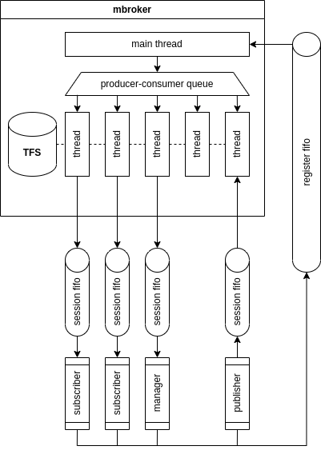

# TecnicoFS

Project done in the scope of the course Operating Systems, IST 2022/2023.

# List of contents

1. [Enunciado (1º Exercício)](#enunciado-1º-exercício)
2. [Enunciado (2º Exercício)](#enunciado-2º-exercício--message-broker)
3. [Pull updates](#Pull-updates)

# Enunciado (1º Exercício)

## Projeto base (ponto de partida)

O projeto base é o TecnicoFS (Técnico _File System_), um sistema de ficheiros simplificado em modo utilizador.
É implementado como uma biblioteca, que pode ser usada por qualquer processo cliente que pretenda ter uma instância privada de um sistema de ficheiros no qual pode manter os seus dados.

### Interface de programação

O TecnicoFS oferece uma interface de programação (API) inspirada na API de sistema de ficheiros POSIX.
No entanto, para simplificar o projeto, a API do TecnicoFS oferece apenas um subconjunto de funções com interface simplificada:

- `int tfs_open(char const *name, int flags);`
- `int tfs_close(int fhandle);`
- `ssize_t tfs_write(int fhandle, void const *buffer, size_t len);`
- `ssize_t tfs_read(int fhandle, void *buffer, size_t len);`

(Nota: o tipo de dados `ssize_t` é definido no _standard_ POSIX para representar tamanhos em _bytes_, podendo também ter o valor `-1` para representar erro.
É, por exemplo, o tipo do retorno das funções `read` e `write` da API de sistema de ficheiros POSIX.)

Além destas funções, existem as funções de inicialização e destruição do sistema de ficheiros, `tfs_init` e `tfs_destroy`.

O código fonte do TecnicoFS encontra-se disponível [neste repositório](https://github.com/tecnico-so/projeto-so-2022-23).
A descrição detalhada de cada função pode ser encontrada na documentação no código fonte do TecnicoFS.

### Estado do sistema de ficheiros

Tal como em FS tradicionais modernos, o conteúdo do FS encontra-se referenciado numa estrutura de dados principal chamada tabela de _i-nodes_, global ao FS.
Cada _i-node_ representa uma diretoria ou um ficheiro no TecnicoFS, que tem um identificador único chamado _i-number_.
O _i-number_ de uma diretoria/ficheiro corresponde ao índice do _i-node_ correspondente na tabela de _i-nodes_.
O _i-node_ consiste numa estrutura de dados que descreve os atributos da diretoria/ficheiro (aquilo que normalmente se chamam os seus _metadados_) e que referencia o conteúdo da diretoria/ficheiro (ou seja, os _dados_).

Além da tabela de _i-nodes_, existe uma região de dados, organizada em blocos de tamanho fixo.
Esta região mantém os dados de todos os ficheiros do FS, sendo esses dados referenciados a partir do _i-node_ de cada ficheiro (na tabela de _i-nodes_).
No caso de ficheiros normais, é na região de dados que é mantido o conteúdo do ficheiro (por exemplo, a sequência de caracteres que compõem um ficheiro de texto).
No caso de diretorias, a região de dados mantém a respetiva tabela, que representa o conjunto de ficheiros (ficheiros normais e subdiretorias) que existem nessa diretoria.

Para facilitar a alocação e libertação de _i-nodes_ e blocos, existe um vetor de alocação associado à tabela de _i-nodes_ e à região de dados, respetivamente.

Além das estruturas de dados mencionadas acima, que mantêm o estado durável do sistema de ficheiros, o TecnicoFS mantém uma tabela de ficheiros abertos.
Essencialmente, esta tabela conhece os ficheiros atualmente abertos pelo processo cliente do TecnicoFS e, para cada ficheiro aberto, indica onde está o cursor atual.
A tabela de ficheiros abertos é descartada quando o sistema é desligado ou termina abruptamente (ou seja, não é durável).

Nas aulas teóricas da 2ª semana, o código base será apresentado e discutido.
Recomendamos a todos os estudantes que frequentem essas aulas antes de começarem a desenvolver a solução.

### Simplificações

Além de uma API simplificada, o desenho e implementação do TecnicoFS adotam algumas simplificações fundamentais, que sumarizamos de seguida:

- Em vez de uma árvore de diretorias, o TecnicoFS tem apenas uma diretoria (a raiz "/"), dentro da qual podem existir ficheiros (e.g., "/f1", "/f2", etc.) mas não outras subdiretorias.
O texto entre aspas nos exemplos anteriores é chamado o **caminho de acesso** ao ficheiro.
- O conteúdo dos ficheiros e da diretoria raiz é limitado a um bloco (cuja dimensão é determinada em tempo de compilação e que é configurada para 1KB, por omissão).
Como consequência, o _i-node_ respetivo tem um campo simples que indica qual o índice desse bloco.
- Assume-se que existe um único processo cliente, que é o único que pode aceder ao sistema de ficheiros.
Consequentemente, existe apenas uma tabela de ficheiros abertos e não há permissões nem controlo de acesso.
- A implementação das funções assume que estas são chamadas por um cliente sequencial, ou seja, a implementação pode resultar em erros caso uma ou mais funções sejam chamadas concorrentemente por duas ou mais tarefas (_threads_) do processo cliente.
Por outras palavras, não é _thread-safe_.
- As estruturas de dados que, em teoria, deveriam ser duráveis, não são mantidas em memória secundária.
Quando o TecnicoFS é terminado, o conteúdo destas estruturas de dados é perdido.

## 1º Exercício

No 1º exercício pretende-se estender a versão base do TecnicoFS com as funcionalidades que são descritas de seguida.

### 1.1 Cópia de um sistema de ficheiros externo

Pretende-se que seja oferecida e implementada uma nova função:

- `int tfs_copy_from_external_fs(char const *source_path, char const *dest_path);`

Esta função copia o conteúdo de um ficheiro `source_path` existente no sistema de ficheiros do sistema operativo no qual o TecnicoFs corre, para o ficheiro _destPath_ guardado no TecnicoFS.
Por outras palavras, importa o conteúdo de um ficheiro do sistema de ficheiros nativo para dentro do TecnicoFS (limitado à dimensão de 1 bloco).

Devolve 0 em caso de sucesso, -1 em caso de erro.

Caso o ficheiro identificado por `dest_path` não exista, este deve ser criado.
Caso contrário, o conteúdo prévio do ficheiro já existente deve ser totalmente substituído pelo novo conteúdo.

Além de implementar esta funcionalidade no TecnicoFS, cada grupo deve desenvolver também pelo menos um programa de teste que demonstre e verifique a correção da solução proposta.

### 1.2 Nomes alternativos e Atalhos

Pretende-se permitir a criação e apagamento de **nomes alternativos** (_hard links_) e **atalhos** (_soft links_) para ficheiros.
Ambos os tipos de _links_ permitem criar ligações alternativas (i.e., pontos de acessos alternativos) para ficheiros pré-existentes no sistemas de ficheiros.
Contudo, estes dois tipos de _links_ têm semânticas diferentes, tal como ilustrado de seguida.

_Nomes alternativos._ Ao criar um _hard link_ "/path\_A/hard\_link" para um ficheiro "/path\_B/file\_name", é acrescentada uma entrada na lista do diretório "/path\_A" cujo nome é "hard\_link" e que aponta para o _i-node_ associado ao ficheiro "/path\_B/file\_name".
Nesse _i-node_ é também incrementado o contador de _hard links_.
Um ficheiro é efetivamente apagado só quando o contador de _hard links_ do relativo _i-node_ atinge o valor `0`.
Nota: este contador é inicializado com o valor `1` ao criar o ficheiro no sistema de ficheiro (o que corresponde, na prática, à criação de um _hard link_ para o ficheiro).

_Atalhos._ Ao criar um _soft link_ "/path\_A/soft\_link" para um ficheiro "/path\_B/file\_name", é acrescentada uma entrada na lista do diretório "/path\_A" cujo nome é "soft\_link" e cujo _conteúdo_ é "/path\_B/file\_name".
A diferença de um _hard link_ para um _soft link_ é que este último não aponta para o _i-node_ associado ao ficheiro "/path\_B/file\_name", mas armazena apenas uma referência para o nome do ficheiro para o qual esse _link_ aponta.
Consequentemente, caso o ficheiro "/path\_B/file\_name" venha a ser apagado após a criação de um _soft link_ para ele, esse ficheiro ("/path\_B/file\_name") é imediatamente apagado do sistema de ficheiros e, portanto, as aplicações que tentem usar esse _soft link_ irão incorrer em erros.

Para a criação de _hard/soft link_ deverão ser implementadas as seguintes funções:

`int tfs_link(char const *target_file, char const *source_file)` // cria um _hard link_

`int tfs_sym_link(char const *target_file, char const *source_file)` // cria um _soft link_

Pretende-se também implementar uma função que permite apagar ficheiros e _links_:

`int tfs_unlink(char const *target)`

Simplificações/observações:

- Podem ser criados _hard links_ apenas para ficheiros (ou diretorias), e nunca para _soft links_;
- Os _soft links_ guardam a referência para o _target_ no bloco de dados.

Cada grupo deverá também desenvolver pelo menos um programa de teste que demonstre e verifique a correção da solução proposta para cada função.

## 1.3 Suporte a chamadas concorrentes por cliente multitarefa

É desejável eliminar a restrição do programa cliente ser _single thread_, permitindo que seja constituído por múltiplas tarefas concorrentes (criadas por `pthread_create`). Pretende-se rever a implementação das funções do TecnicoFS para as tornar corretas quando executadas concorrentemente (i.e., _thread-safe_).

Para cumprir este requisito, devem ser usados trincos lógicos (`pthread_mutex`) ou trincos de leitura-escrita (`pthread_rwlock`), ficando a sua escolha ao critério dos estudantes.

A solução deve maximizar o paralelismo, recorrendo a sincronização fina.
Uma solução baseada em trincos que colocam em exclusão mútua a totalidade ou grande parte das estruturas de dados do TecnicoFS será fortemente penalizada na avaliação.

Caso sintam que a interface de funções que gerem o estado do TecnicoFS (definida em `fs/state.h`) não é a mais apropriada para resolver este requisito, podem adaptar essa interface para uma alternativa mais apropriada.
Recomendamos que, antes de começarem a implementar, discutam o desenho da vossa solução com o docente de laboratório.

Além da adaptação do TecnicoFS para o tornar _thread-safe,_ cada grupo deve **compor uma bateria de, pelo menos, três programas cliente paralelos**.

----

### Submissão e avaliação

A submissão é feita através do Fénix **até ao dia 20/Dezembro/2022 às 23h59**.

Os estudantes devem submeter um ficheiro no formato `zip` com o código fonte e o ficheiro `Makefile`.
O arquivo submetido não deve incluir outros ficheiros (tais como binários).
Além disso, o comando `make clean` deve limpar todos os ficheiros resultantes da compilação do projeto.

Recomendamos que os alunos se assegurem que o projeto compila/corre corretamente no [ambiente de referência](https://github.com/tecnico-so/lab_ambiente).
Ao avaliar os projetos submetidos, em caso de dúvida sobre o funcionamento do código submetido, os docentes usarão o ambiente de referência para fazer a validação final.
O uso de outros ambientes para o desenvolvimento/teste do projeto (e.g., macOS, Windows/WSL) é permitido, mas o corpo docente não dará apoio técnico a dúvidas relacionadas especificamente com esses ambientes.

A avaliação será feita de acordo com o método de avaliação descrito na página Fénix da cadeira.

_Bom trabalho!_

# Enunciado (2º Exercício | _Message Broker_)

O segundo exercício do projeto pretende construir um sistema simples de publicação e subscrição de mensagens, que são armazenadas no sistema de ficheiros TecnicoFS.
O sistema vai ter um processo servidor autónomo, ao qual diferentes processos clientes se podem ligar, para publicar ou receber mensagens numa dada caixa de armazenamento de mensagens.

## Ponto de partida

Para resolver o segundo exercício, os grupos devem usar como base a sua solução do 1º exercício ou [aceder ao novo código base](https://github.com/tecnico-so/projeto-so-2022-23/), que estende a versão original do TecnicoFS das seguintes maneiras:

- As operações principais do TecnicoFS estão sincronizadas usando um único trinco (_mutex_) global.
Embora menos paralela que a solução pretendida para o primeiro exercício, esta solução de sincronização é suficiente para implementar os novos requisitos;
- É implementada a operação `tfs_unlink`, que permite remover ficheiros.

Adicionalmente, o código base inclui esqueletos para:

1. O programa do servidor _mbroker_ (na diretoria `mbroker`);
2. A implementação do cliente para publicação (na diretoria `publisher`);
3. A implementação do cliente para subscrição (na diretoria `subscriber`);
4. A implementação do cliente de gestão (diretoria `manager`).

Em vez do novo código base, os grupos que tenham uma solução robusta no 1º exercício são encorajados a construírem a solução com base na sua versão, que, à partida, estará mais otimizada em termos de concorrência.

## 1. Arquitetura do sistema

O sistema é formado pelo servidor (_mbroker_) e por vários publicadores (_publishers_), subscritores (_subscribers_) e gestores (_manager_).

### Caixas de Mensagens

Um conceito fundamental do sistema são as caixas de mensagens.
Cada caixa pode ter um publicador e múltiplos subscritores.
O _publisher_ coloca mensagens na caixa, e os vários _subscribers_ lêem as mensagens da caixa.
Cada caixa é suportada no servidor por um ficheiro no TFS.
Por esta razão, o ciclo de vida de uma caixa é distinto do ciclo de vida do _publisher_ que lá publica mensagens.
Aliás, é possível que uma caixa venha a ter vários _publishers_ ao longo da sua existência, embora apenas um de cada vez.

As operações de criação e remoção de caixa são geridas pelo _manager_.
Adicionalmente, o _manager_ permite listar as caixas existentes na _mbroker_.

### 1.1. Servidor

O servidor incorpora o TecnicoFS e é um processo autónomo, inicializado da seguinte forma:

```sh
$ mbroker <register_pipe_name> <max_sessions>
```

O servidor cria um _named pipe_ cujo nome é o indicado no argumento acima.
É através deste _named pipe_, criado pelo servidor, que os processos cliente se poderão ligar para se registarem.

Qualquer processo cliente pode ligar-se ao _named pipe_ do servidor e enviar-lhe uma mensagem a solicitar o início de uma sessão.
Uma **sessão** consiste em ter um _named pipe_ do cliente, onde o cliente envia as mensagens (se for um publicador) ou onde o cliente recebe mensagens (se for um subscritor).
Existe também o _manager_.
Um dado cliente apenas assume um papel, ou seja, ou é exclusivamente publicador, subscritor, ou gestor.

O _named pipe_ da sessão deve ser criado previamente pelo cliente.
Na mensagem de registo, o cliente envia o nome do _named pipe_ a usar durante a sessão.

O nome do _named pipe_ da sessão deve ser escolhido manualmente quando um cliente é lançado e de forma a garantir que não existem conflitos com outros clientes concorrentes.

Uma sessão mantém-se aberta até que aconteça uma das seguintes situações:

1. Um cliente feche o seu _named pipe_, sinalizando implicitamente o fim de sessão;
2. A caixa é removida pelo gestor.

O _named pipe_ deve ser removido do sistema de ficheiros pelo respetivo cliente após o fim da sessão.

O servidor aceita um número máximo de sessões em simultâneo, definido pelo valor do argumento `max_sessions`.

Nas subsecções seguintes descrevemos o protocolo cliente-servidor em maior detalhe, i.e., o conteúdo das mensagens de pedido e resposta trocadas entre clientes e servidor.

#### 1.1.1. Arquitetura do servidor

O servidor deve usar a _main thread_ para gerir o _named pipe_ de registo e lançar `max_sessions` _threads_ para processar sessões.
Quando chega um novo pedido de registo, este deve ser encaminhado para uma _thread_ que se encontre disponível, que irá processá-lo durante o tempo necessário.
Para gerir estes pedidos, evitando que as _threads_ fiquem em espera ativa, a _main thread_ e as _worker threads_ cooperam utilizando uma **fila produtor-consumidor**, segundo a interface disponibilizada no ficheiro `producer-consumer.h`.
Desta forma, quando chega um novo pedido de registo, este é colocado na fila e assim que uma _thread_ fique disponível, irá consumir e tratar esse pedido.

A arquitetura do servidor está sumarizada na seguinte figura:



- O _mbroker_ usa o TFS para armazenar as mensagens das caixas;
- A _main thread_ recebe pedidos através do _register pipe_ e coloca-os numa fila de produtor-consumidor;
- As _worker threads_ executam os pedidos dos clientes, dedicando-se a atender um cliente de cada vez;
- Cooperam com a _main thread_ através de uma fila produtor-consumidor, que evita espera ativa.

### 1.2. _Publisher_

Um publicador é um processo lançado da seguinte forma:

```sh
pub <register_pipe_name> <pipe_name> <box_name>
```

Assim que é lançado, o _publisher_, pede para iniciar uma sessão no servidor de _mbroker_, indicando a caixa de mensagens para a qual pretende escrever mensagens.
Se a ligação for aceite (pode ser rejeitada caso já haja um _publisher_ ligado à caixa, por exemplo) fica a receber mensagens do `stdin` e depois publica-as.
Uma **mensagem** corresponde a uma linha do `stdin`, sendo truncada a um dado valor máximo e delimitada por um `\0`, como uma _string_ de C.
A mensagem não deve incluir um `\n` final.

Se o _publisher_ receber um EOF (_End Of File_, por exemplo, com um Ctrl-D), deve encerrar a sessão fechando o _named pipe_.

### 1.3. _Subscriber_

Um subscritor é um processo lançado da seguinte forma:

```sh
sub <register_pipe_name> <pipe_name> <box_name>
```

Assim que é lançado, o _subscriber_:

1. Liga-se à _mbroker_, indicando qual a caixa de mensagens que pretende subscrever;
2. Recolhe as mensagens já aí armazenadas e imprime-as uma a uma no `stdout`, delimitadas por `\n`;
3. Fica à escuta de novas mensagens;
4. Imprime novas mensagens quando são escritas para o _named pipe_ para o qual tem uma sessão aberta.

Para terminar o _subscriber_, este deve processar adequadamente o `SIGINT` (i.e., o Ctrl-C), fechando a sessão e imprimindo no `stdout` o número de mensagens recebidas durante a sessão.

### 1.4. _Manager_

Um gestor é um processo lançado de uma das seguintes formas:

```sh
manager <register_pipe_name> <pipe_name> create <box_name>
manager <register_pipe_name> <pipe_name> remove <box_name>
manager <register_pipe_name> <pipe_name> list
```

Assim que é lançado, o _manager_:

 1. Envia o pedido à _mbroker_;
 2. Recebe a resposta no _named pipe_ criado pelo próprio _manager_;
 3. Imprime a resposta e termina.

### 1.5. Exemplos de execução

Um primeiro **exemplo** considera o funcionamento **sequencial** dos clientes:

 1. Um _manager_ cria a caixa `bla`;
 2. Um _publisher_ liga-se à mesma caixa, escreve 3 mensagens e desliga-se;
 3. Um _subscriber_ liga-se à mesma caixa e começa a receber mensagens;
 4. Recebe as três, uma de cada vez, e depois fica à espera de mais mensagens.

Num segundo **exemplo**, mais interessante, vai existir **concorrência** entre clientes:

 1. Um _publisher_ liga-se;
 2. Entretanto, um _subscriber_ para a mesma caixa, liga-se também;
 3. O _publisher_ coloca mensagens na caixa e estas vão sendo entregues imediatamente ao _subscriber_, ficando à mesma registadas no ficheiro;
 4. Um outro _subscriber_ liga-se à mesma caixa, e começa a receber as mensagens todas desde o início;
 5. Agora, quando o _publisher_ escreve uma nova mensagem, ambos os _subscriber_ recebem a mensagem diretamente.

## 2. Protocolo

Para moderar a interação entre o servidor e os clientes, é estabelecido um protocolo, que define como é que as mensagens são serializadas, ou seja, como é que ficam arrumadas num _buffer_ de _bytes_.
Este tipo de protocolo é por vezes referido como um _wire protocol_, numa alusão aos dados que efetivamente circulam no meio de transmissão, que neste caso, serão os _named pipes_.

O conteúdo de cada mensagem deve seguir o seguinte formato, onde:

- O símbolo `|` denota a concatenação de elementos numa mensagem;
- Todas as mensagens de pedido são iniciadas por um código que identifica a operação solicitada (`OP_CODE`);
- As _strings_ que transportam, por exemplo, os nomes de _named pipes_ são de tamanho fixo, indicado na mensagem.
No caso de texto com tamanho inferior, os caracteres adicionais devem ser preenchidos com `\0`.

### 2.1. Registo

O _named pipe_ do servidor, que só recebe registos de novos clientes, deve receber mensagens do seguinte tipo:

Pedido de registo de _publisher_:

```
[ code = 1 (uint8_t) ] | [ client_named_pipe_path (char[256]) ] | [ box_name (char[32]) ]
```

Pedido de registo de _subscriber_:

```
[ code = 2 (uint8_t) ] | [ client_named_pipe_path (char[256]) ] | [ box_name (char[32]) ]
```

Pedido de criação de caixa:

```
[ code = 3 (uint8_t) ] | [ client_named_pipe_path (char[256]) ] | [ box_name (char[32]) ]
```

Resposta ao pedido de criação de caixa:

```
[ code = 4 (uint8_t) ] | [ return_code (int32_t) ] | [ error_message (char[1024]) ]
```

O return code deve ser `0` se a caixa foi criada com sucesso, e `-1` em caso de erro.
Em caso de erro a mensagem de erro é enviada (caso contrário, fica simplesmente inicializada com `\0`).

Pedido de remoção de caixa:

```
[ code = 5 (uint8_t) ] | [ client_named_pipe_path (char[256]) ] | [ box_name (char[32]) ]
```

Resposta ao pedido de remoção de caixa:

```
[ code = 6 (uint8_t) ] | [ return_code (int32_t) ] | [ error_message (char[1024]) ]
```

Pedido de listagem de caixas:

```
[ code = 7 (uint8_t) ] | [ client_named_pipe_path (char[256]) ]
```

A resposta à listagem de caixas vem em várias mensagens, do seguinte tipo:

```
[ code = 8 (uint8_t) ] | [ last (uint8_t) ] | [ box_name (char[32]) ] | [ box_size (uint64_t) ] | [ n_publishers (uint64_t) ] | [ n_subscribers (uint64_t) ]
```

O byte `last` é `1` se esta for a última caixa da listagem e a `0` em caso contrário.
`box_size` é o tamanho (em _bytes_) da caixa, `n_publisher` (`0` ou `1`) indica se existe um _publisher_ ligado à caixa naquele momento e `n_subscriber` indica o número de subscritores da caixa naquele momento.

Se não existirem caixas, a resposta é uma mensagem com `last` a `1` e `box_name` toda preenchida com `\0`.

### 2.2 _Publisher_

O publicador envia mensagens para o servidor do tipo:

```
[ code = 9 (uint8_t) ] | [ message (char[1024]) ]
```

### 2.3 _Subscriber_

O servidor envia mensagens para o subscritor do tipo:

```
[ code = 10 (uint8_t) ] | [ message (char[1024]) ]
```

## 3. Requisitos de implementação

### 3.1. Tratamento de clientes

Quando o servidor inicia, lança um conjunto de `S` tarefas (_thread pool_), que ficam à espera de pedidos de registo para tratar, que irão receber através da fila produtor-consumidor.
A _main thread_ gere o _named pipe_ de registo, e coloca os pedidos de registo na fila produtor-consumidor.
Quando uma _thread_ termina uma sessão, fica à espera de nova sessão para tratar.

### 3.2 Caixas de armazenamento

As mensagens recebidas pelo servidor devem ser colocadas numa caixa.
Na prática, uma caixa corresponde a um ficheiro no TecnicoFS.
O ficheiro deve ser criado quando a caixa for criada pelo _manager_, e apagado quando a caixa for removida.
Todas as mensagens que vão sendo recebidas são escritas no fim do ficheiro, separadas por `\0`.

Resumindo, as mensagens são acumuladas nas caixas.
Quando um subscritor se liga a uma caixa, o ficheiro correspondente é aberto e as mensagens começam a ser lidas desde o início (mesmo que o mesmo subscritor ou outro já as tenha recebido antes).
Ulteriores mensagens geradas pelo _publisher_ de uma caixa deverão ser também entregues aos _subscribers_ da caixa.
Esta funcionalidade deverá ser implementada usando **variáveis de condição** com o objetivo de evitar esperas ativas.

### 3.3 Formatação de mensagens

Para uniformizar o _output_ dos diversos comandos (para o `stdout`), é fornecido o formato com que estas devem ser impressas.

### 3.4 Fila Produtor-Consumidor

A fila produtor-consumidor é a estrutura de sincronização mais complexa do projeto.
Por isso, esta componente vai ser avaliada em isolamento (i.e., existirão testes que usam apenas a interface descrita no `producer-consumer.h`) para garantir a sua correção.
Como tal, a interface do `producer-consumer.h` não deve ser alterada.

De resto, os grupos são livres de alterar o código base como lhes for conveniente.

#### Mensagens do subscritor

```c
fprintf(stdout, "%s\n", message);
```

#### Resultados das operações do gestor

Se o comando de criação ou remoção de caixa for bem sucedido, deve imprimir-se:

```c
fprintf(stdout, "OK\n");
```

Se tiver ocorrido um erro:

```c
fprintf(stdout, "ERROR %s\n", error_message);
```

#### Listagem de caixas

Cada linha da listagem de caixas deve ser impressa da seguinte forma:

```c
fprintf(stdout, "%s %zu %zu %zu\n", box_name, box_size, n_publishers, n_subscribers);
```

As caixas devem estar ordenadas por ordem alfabética, não sendo garantido que o servidor as envie por essa ordem (i.e., o cliente deve ordenar as caixas antes das imprimir).

Se não existirem caixas, deve ser impresso o seguinte:

```c
fprintf(stdout, "NO BOXES FOUND\n");
```

### 3.5 Espera Ativa

No projeto, **nunca** devem ser usados mecanismos de espera ativa.

## 4. Sugestão de implementação

Sugere-se que implementem o projeto através dos seguintes passos:

1. Implementar as interfaces de linha de comando (CLI) dos clientes;
2. Implementar a serialização do protocolo de comunicação;
3. Implementar uma versão básica do `mbroker`, onde só existe uma _thread_ que, em ciclo, a) recebe um pedido de registo; b) trata a sessão correspondente; e c) volta a ficar à espera do pedido de registo;
4. Implementar a fila produtor-consumidor;
5. Utilizar a fila produtor-consumidor para gerir e encaminhar os pedidos de registo para as _worker threads_.

## 5. Submissão e avaliação

A submissão é feita através do Fénix **até sexta-feira, dia 13/Janeiro/2023, às 20h00**.

Os estudantes devem submeter um ficheiro no formato `zip` com o código fonte e o ficheiro `Makefile`.
O arquivo submetido não deve incluir outros ficheiros (tais como binários).
Além disso, o comando `make clean` deve limpar todos os ficheiros resultantes da compilação do projeto, bem como o comando `make fmt`, para formatar automaticamente o código.

Recomendamos que os alunos se assegurem que o projeto compila/corre corretamente no [ambiente de referência](https://github.com/tecnico-so/lab_ambiente).
Ao avaliar os projetos submetidos, em caso de dúvida sobre o funcionamento do código submetido, os docentes usarão o ambiente de referência para fazer a validação final.
O uso de outros ambientes para o desenvolvimento/teste do projeto (e.g., macOS, Windows/WSL) é permitido, mas o corpo docente não dará apoio técnico a dúvidas relacionadas especificamente com esses ambientes.

A avaliação será feita de acordo com o método de avaliação descrito no Fénix

_Bom trabalho!_

# Pull updates

```
git remote add public https://github.com/tecnico-so/projeto-so-2022-23
git pull public main
git push origin main
```
